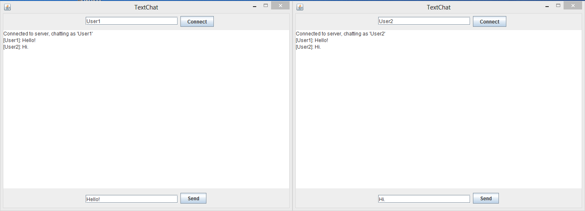
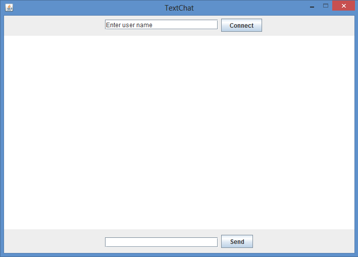

# Java-TextChat
Java program that allows for text communication over a LAN network.

__Example:__

__Usage:__
First, start the server the program will use by running Server.java
Next, for each client trying to use run Client.java

Then, enter your username, click on "Connect" and start chatting!
