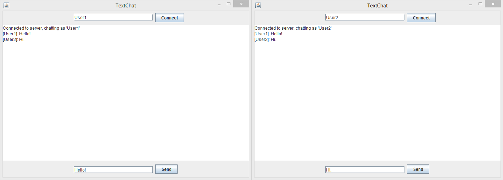

# Java-TextChat
Java program that allows for text communication over a LAN network.

__Example:__

__Usage:__
First, start the server the program will use by running Server.java.
Next, run Client.java for each client to connect to the server

Then, enter your username, click on "Connect" and start chatting!
